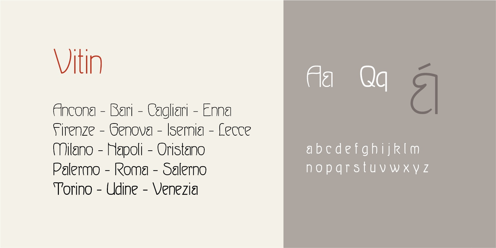

# Vitin
- Versione 1.0: versione iniziale.

Per testare il font nella versione variabile, vedere la [pagina interattiva](https://m-casanova.github.io/Vitin/).

## Descrizione

**Vitin** è un font variabile basato su scansioni del font [*Wettin*](https://fontsinuse.com/typefaces/120575/wettin-and-ovid), disegnato da Heinz Keune per Schelter & Giesecke nel 1902.
Per rendere il font facilmente variabile, alcune caratteristiche del font originario sono state modificate.

*Vitin* è l'antico nome della città di Wettin, secondo un  documento dell'anno 961 ("[ubi est Vitin civitas](https://archive.org/details/bub_gb_wXRBAAAAYAAJ/page/n29/mode/2up?q=vitin)").