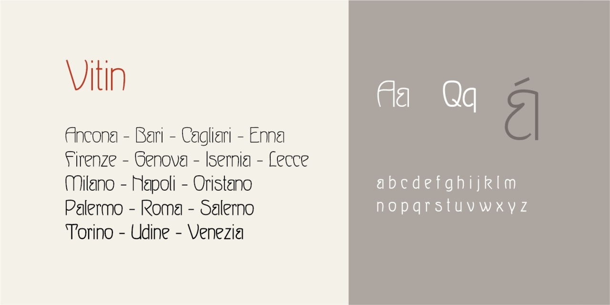

# Vitin
- Versione 1.101: fix esportazione
- Versione 1.0: versione iniziale

Per testare il font nella versione variabile, vedere la [pagina interattiva](https://m-casanova.github.io/Vitin/).

## Descrizione

**Vitin** è un font variabile basato su scansioni del font [*Wettin*](https://fontsinuse.com/typefaces/120575/wettin-and-ovid), disegnato da Heinz Keune per Schelter & Giesecke nel 1902.
Per rendere il font facilmente variabile, alcune caratteristiche del font originario sono state modificate.

*Vitin* è l'antico nome della città di Wettin, secondo un  documento del 29 luglio 961 ("ubi inest Vitin civitas", in MGH, [_Diplomata, Konrad I-Heinrich I-Otto I_, doc. 231](https://www.dmgh.de/mgh_dd_ko_i__dd_h_i__dd_o_i/index.htm#page/316/mode/1up), pp. 316-317).
